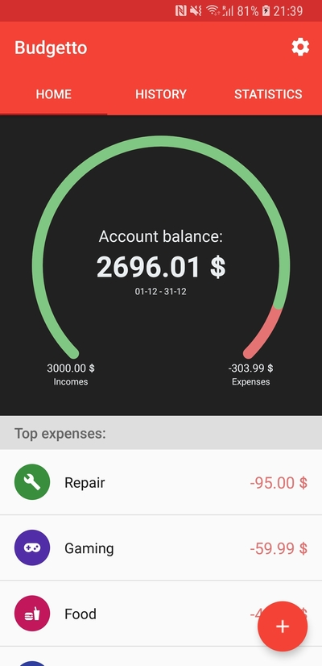
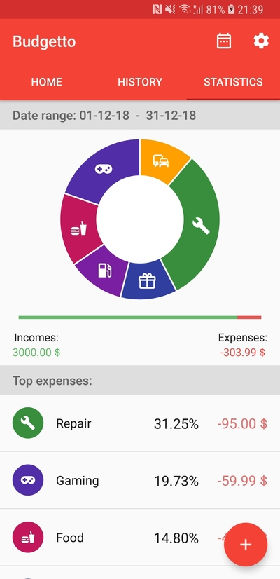

# Expense Tracker

## Overview
Expense Tracker is a mobile application designed to help users manage their income and expenses efficiently. With Firebase integration, users can securely authenticate and store their financial data in real-time. The app provides insights into spending patterns through an intuitive statistics section, enabling better financial planning.

## Features
- **User Authentication:** Secure sign-in using Firebase Authentication with Google Sign-In.
- **Real-time Database:** Track income and expenses with Firebase Realtime Database.
- **Budget Management:** Easily add and categorize financial transactions.
- **Interactive Statistics:** Visual representation of spending habits.
- **User-friendly Interface:** Designed for smooth navigation and usability.

## Screenshots
### Home Page


### Statistics Section


## Tech Stack
- **Android Studio** - Development environment
- **Java** - Primary programming language
- **Firebase Authentication** - User authentication with Google Sign-In
- **Firebase Realtime Database** - Data storage and management
- **Material Design** - UI components for a modern look

## Installation
1. Clone the repository:
   ```sh
   git clone https://github.com/roland7734/ExpenseTrackerUsingFirebase.git
   ```
2. Open the project in **Android Studio**.
3. Configure Firebase:
   - Add the `google-services.json` file to the `app/` directory.
   - Enable Firebase Authentication and Realtime Database in the Firebase Console.
4. Build and run the app on an Android device or emulator.

## Usage
- Sign in using Google Authentication.
- Add income and expense entries with categories.
- View real-time statistics and manage your budget effectively.
- Log out securely when finished.

Happy budgeting! 🎯

